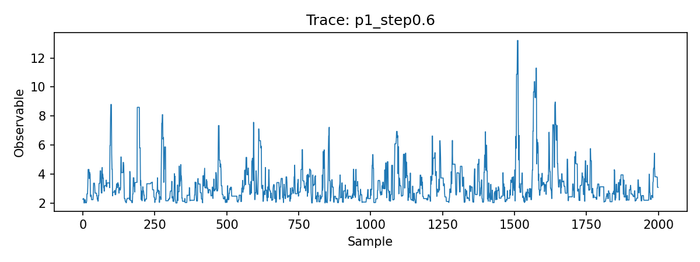
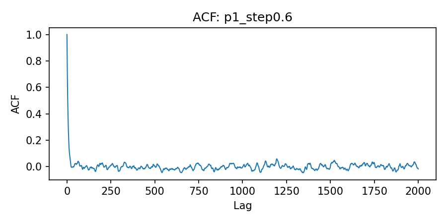
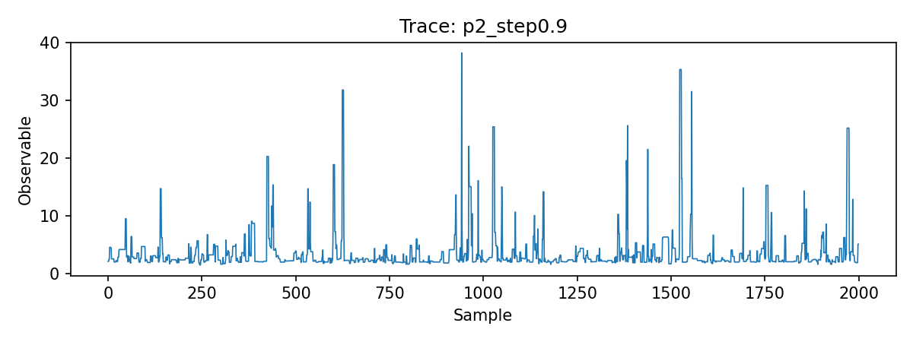
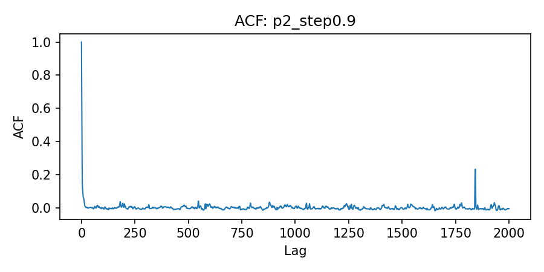

# MCMC 二维积分上机报告
王志超 23343062
<br>
2026/5/7

**目录**

- [实践平台说明](#实践平台说明)
- [实践内容介绍](#实践内容介绍)
- [分析思考](#分析思考)
- [程序使用方法](#程序使用方法)
- [程序运行结果](#程序运行结果)
- [补充说明](#补充说明)
- [源码附录](#源码附录)
  - [C++ Sampler (src/mcmc\_integral.cpp)](#c-sampler-srcmcmc_integralcpp)
  - [Python Analysis (analysis/analyze\_mcmc.py)](#python-analysis-analysisanalyze_mcmcpy)
  - [Build Script (Makefile)](#build-script-makefile)

## 实践平台说明
- OS: Linux
- Compiler: g++ (std=C++17)
- Python environment: 3.13.5

**本地配置详情：**

- Release: Debian GNU/Linux 13 (trixie)
- Kernel: 6.12.86+deb13-amd64
- CPU: Intel(R) Core(TM) Ultra 5 125H, 18 threads
- Memory: 30 GiB RAM, 23 GiB Swap
- Python packages: numpy 2.4.4, matplotlib 3.10.9

## 实践内容介绍
利用 Metropolis-Hastings (MH) 算法上机编程计算如下二维积分：

$$
I = \int_{-2}^{2} dx \int_{0}^{2 + x} dy\,(2 + x^2 + y^2) e^{-x^2 - y^2 + xy}
$$

分别利用如下两个重要性抽样分布的概率密度函数：

$$
q_1(x,y) = e^{-x^2 - y^2 + xy},\quad q_2(x,y) = e^{-x^2 - y^2}.
$$

其中归一化的概率密度函数为 $p_1 = q_1 / Z_1$ 且 $p_2 = q_2 / Z_2$，$Z_1$ 和 $Z_2$ 分别为积分域上的归一化常数。

## 分析思考

**1. 分布密度函数归一化在有限区间做还是无穷区间做？对计算结果是否有差别？**

- 在要计算的有限区间上做归一化：

  - 如果密度函数在全平面（无穷区间）上进行归一化，其归一化常数将不同于题目所给区域的真实常数。在受限的有限域上使用 MH 采样时（对边界外的提议予以拒绝），其采得的样本正是该有限区间上的目标分布；

  - 当求最终的期望值来估算积分时，必须乘以该有限积分区间的分布归一化常数，使用无穷区间的常数的话结果将产生显著偏差，导致计算错误。

- 理论上，在无穷平面上归一化常数分别为 $Z_2 = \pi$ 且 $Z_1 = 2\pi/\sqrt{3}$。而在本题的有限积分域中，实际上数值积分求得 $Z_1 \approx 1.76$、$Z_2 \approx 1.50$，两者差异巨大。

**2. 如何做 Markov 链游走？**

- 利用高斯随机游走 (Gaussian random-walk) 作为提议分布 (Proposal distribution)：

  - 使用标准差 $\sigma$ 来控制游走步长；

  - 每步提议出新坐标点，先检查候选点是否落在给定的二维定义域界限内（如 $y \le 2+x$ 且 $x \in [-2, 2]$）；

  - 如果落在区域以外，则在接受率判定时被直接等价于概率为0从而拒绝，马尔可夫链停留在前一状态。

- 这里为了保证蒙特卡洛积分的效率，需要通过测试选取一组合适的游走步长 $\sigma$。合理的步长能够在“保证一定的接受率避免状态陷入局部停滞”与“减小样本间的自相关性以加快收敛”二者之间取得平衡。

## 程序使用方法

**1. 编译构建程序：**

```bash
make
```

**2. 逐个运行单条马尔可夫链，例如 $p_1$ 分布、游走步长$\sigma=0.6$**

```bash
./mcmc_integral --density p1 --samples 20000 --burn 5000 --thin 1 --step 0.6 --output data/p1_step0.6.csv
```

**3. 数据分析及可视化作图：**

```bash
python analysis/analyze_mcmc.py data/*.csv --out-dir figures
```

## 程序运行结果
**有限区间上的分布函数归一化（采用 $200\times200$ 网格的辛普森 / Simpson 积分法计算）：**

$$
Z_1 = 1.76485582,\quad Z_2 = 1.49646379
$$

**步长测试扫描（每次采样：20,000 个保留样本，5,000 步为老化期 / Burn-in）：**

| 密度函数 | 游走步长 ($\sigma$) | 接受率 | 积分估计值 | 积分自相关时间 ($\tau_{int}$) | 建议抽样间隔 ($N_0$) |
| :-: | :-: | :-: | :-: | :-: | :-: |
| $p_1$ | 0.3 | 0.691 | 5.6577 | 34.417 | 69 |
| $p_1$ | 0.6 | 0.472 | 5.5962 | 12.270 | 25 |
| $p_1$ | 0.9 | 0.321 | 5.6882 | 14.742 | 30 |
| $p_1$ | 1.2 | 0.228 | 5.6429 | 11.622 | 24 |
| $p_2$ | 0.3 | 0.672 | 5.6553 | 19.235 | 39 |
| $p_2$ | 0.6 | 0.434 | 5.5004 | 7.885 | 16 |
| $p_2$ | 0.9 | 0.288 | 5.7362 | 5.589 | 12 |
| $p_2$ | 1.2 | 0.201 | 5.5333 | 11.107 | 23 |

**各密度函数的最佳配置与分析：**

- 对于 $p_1$：推荐游走步长为 $\sigma \approx 0.6$，此时具备合理的接受率（$47.2\%$），且对应的自相关时间 $\tau_{int} \approx 12.27$ 较小，样本能较快趋于独立。根据 $N_0 \ge 2\tau_{int}$ 的经验公式，建议的间隔取点应设为 $N_0 = 25$。
- 对于 $p_2$：推荐游走步长为 $\sigma \approx 0.9$，在扫描测试中表现出最小的自相关时间（$\tau_{int} \approx 5.59$）。依同理，对于该密度函数此时的建议抽样间隔为 $N_0 = 12$。

由此，可以通过每隔 $N_0$ 步提取一次样本以获取趋近于独立同分布 (i.i.d) 的有效采样。

部分自相关函数 (ACF) 与抽样序列 (Trace) 的可视化结果展示如下。

**基于密度 $p_1$ (游走步长 $\sigma=0.6$)：**
在使用 $\sigma=0.6$ 的高斯游走步长时，Trace 图显示马尔可夫链能够很好地探索样本空间，没有出现长时间的滞留现象；同时 ACF 图表明自相关函数在间隔 20 步左右便快速衰减至 0 附近，说明样本间的相关性较低，采样效率良好。

<div align="center">
  
  <br>
  <em>图 1：密度 $p_1$（步长 $\sigma=0.6$）前 2000 步采样的 Trace 图，可以看到抽样序列呈现平稳的混合过程。（横坐标：采样步数 Sample，纵坐标：有效观测量 Observable）</em>
</div>

<div align="center">
  
  <br>
  <em>图 2：密度 $p_1$（步长 $\sigma=0.6$）的自相关函数 (ACF) 衰减图，可以看到相关性随延迟步数呈快速下降。（横坐标：延迟步数 Lag，纵坐标：自相关系数 ACF）</em>
</div>
<br>

**基于密度 $p_2$ (游走步长 $\sigma=0.9$)：**
对于密度 $p_2$，步长 $\sigma=0.9$ 表现出最优的自相关时间（$\tau_{int} \approx 5.6$）。从 Trace 图可以看出序列在均值附近高频振荡且混合充分；对应的 ACF 图极快地衰减到接近 0 的水平，代表了非常理想的独立同分布 (i.i.d) 近似。

<div align="center">
  
  <br>
  <em>图 3：密度 $p_2$（步长 $\sigma=0.9$）前 2000 步采样的 Trace 图，链波动均匀且收敛快。（横坐标：采样步数 Sample，纵坐标：有效观测量 Observable）</em>
</div>

<div align="center">
  
  <br>
  <em>图 4：密度 $p_2$（步长 $\sigma=0.9$）的自相关函数 (ACF) 衰减图，可见 ACF 在 10 步以内基本降至零。（横坐标：延迟步数 Lag，纵坐标：自相关系数 ACF）</em>
</div>


## 补充说明

根据重要性采样 (Importance Sampling) 的基本原理，对于待求积分 $I = \int f(x,y) dx dy$，当我们引入符合某种已知分布的概率密度函数 $p(x,y)$ 时，积分类式的期望值可等价改写为：

$$
I = \int \frac{f(x,y)}{p(x,y)} p(x,y) dx dy = \mathbb{E}_{p}\left[ \frac{f(x,y)}{p(x,y)} \right]
$$

通过马尔可夫链蒙特卡洛 (MCMC) 方法从 $p(x,y)$ 中抽取一系列样本点 $(x_i, y_i)$ 时，积分值即可通过下式进行蒙特卡洛估计：

$$
I \approx \frac{1}{N} \sum_{i=1}^N \frac{f(x_i, y_i)}{p(x_i, y_i)}
$$

而在本题情图下，被积函数的核心部分 $f(x,y) = (2 + x^2 + y^2) e^{-x^2 - y^2 + xy}$。

**1. 基于密度 $p_1$ 的抽样估算：**
已知概率密度函数 $p_1(x,y) = \frac{1}{Z_1} e^{-x^2 - y^2 + xy}$。代入上述原理公式中，每次采样的有效观测量 $O_1(x,y)$ 为：

$$
\frac{f(x,y)}{p_1(x,y)} = \frac{(2 + x^2 + y^2) e^{-x^2 - y^2 + xy}}{\frac{1}{Z_1} e^{-x^2 - y^2 + xy}} = Z_1 (2 + x^2 + y^2)
$$

因此最终的估计等式提炼为：$I = Z_1 \langle 2 + x^2 + y^2 \rangle_{p_1}$。

**2. 基于密度 $p_2$ 的抽样估算：**
同理，针对密度函数 $p_2(x,y) = \frac{1}{Z_2} e^{-x^2 - y^2}$ 进行变换，对应的有效观测量 $O_2(x,y)$ 为：

$$
\frac{f(x,y)}{p_2(x,y)} = \frac{(2 + x^2 + y^2) e^{-x^2 - y^2 + xy}}{\frac{1}{Z_2} e^{-x^2 - y^2}} = Z_2 (2 + x^2 + y^2) e^{xy}
$$

所以得到最终估计等式为：$I = Z_2 \langle (2 + x^2 + y^2) e^{xy} \rangle_{p_2}$。

## 源码附录

### C++ Sampler (src/mcmc_integral.cpp)

```cpp
#include <cmath>
#include <cstdint>
#include <fstream>
#include <iomanip>
#include <iostream>
#include <random>
#include <sstream>
#include <string>
#include <vector>

struct Options {
	std::string density = "p1";
	int64_t samples = 20000;
	int64_t burn_in = 5000;
	int64_t thin = 1;
	double step = 0.6;
	uint64_t seed = 12345;
	int grid_nx = 200;
	int grid_ny = 200;
	std::string output = "";
};

bool in_domain(double x, double y) {
	if (x < -2.0 || x > 2.0) {
		return false;
	}
	if (y < 0.0) {
		return false;
	}
	double ymax = 2.0 + x;
	return y <= ymax;
}

double log_q1(double x, double y) {
	return -(x * x) - (y * y) + x * y;
}

double log_q2(double x, double y) {
	return -(x * x) - (y * y);
}

double simpson_1d(const std::vector<double> &values, double h) {
	if (values.size() < 2) {
		return 0.0;
	}
	double sum = values.front() + values.back();
	for (size_t i = 1; i + 1 < values.size(); ++i) {
		sum += (i % 2 == 0) ? 2.0 * values[i] : 4.0 * values[i];
	}
	return sum * h / 3.0;
}

double integrate_2d_simpson(int nx, int ny, const std::string &density) {
	if (nx % 2 == 1) {
		nx += 1;
	}
	if (ny % 2 == 1) {
		ny += 1;
	}
	double x_min = -2.0;
	double x_max = 2.0;
	double hx = (x_max - x_min) / nx;
	std::vector<double> x_values(nx + 1);
	for (int i = 0; i <= nx; ++i) {
		x_values[i] = x_min + i * hx;
	}

	std::vector<double> fx(nx + 1, 0.0);
	for (int i = 0; i <= nx; ++i) {
		double x = x_values[i];
		double y_min = 0.0;
		double y_max = 2.0 + x;
		if (y_max <= y_min) {
			fx[i] = 0.0;
			continue;
		}
		double hy = (y_max - y_min) / ny;
		std::vector<double> y_vals(ny + 1, 0.0);
		for (int j = 0; j <= ny; ++j) {
			double y = y_min + j * hy;
			double val = 0.0;
			if (density == "p1") {
				val = std::exp(log_q1(x, y));
			} else {
				val = std::exp(log_q2(x, y));
			}
			y_vals[j] = val;
		}
		fx[i] = simpson_1d(y_vals, hy);
	}
	return simpson_1d(fx, hx);
}

Options parse_args(int argc, char **argv) {
	Options opts;
	for (int i = 1; i < argc; ++i) {
		std::string arg = argv[i];
		auto next = [&](double &target) {
			if (i + 1 < argc) {
				target = std::stod(argv[++i]);
			}
		};
		auto next_int = [&](int64_t &target) {
			if (i + 1 < argc) {
				target = std::stoll(argv[++i]);
			}
		};
		auto next_uint = [&](uint64_t &target) {
			if (i + 1 < argc) {
				target = static_cast<uint64_t>(std::stoull(argv[++i]));
			}
		};
		auto next_str = [&](std::string &target) {
			if (i + 1 < argc) {
				target = argv[++i];
			}
		};

		if (arg == "--density") {
			next_str(opts.density);
		} else if (arg == "--samples") {
			next_int(opts.samples);
		} else if (arg == "--burn") {
			next_int(opts.burn_in);
		} else if (arg == "--thin") {
			next_int(opts.thin);
		} else if (arg == "--step") {
			next(opts.step);
		} else if (arg == "--seed") {
			next_uint(opts.seed);
		} else if (arg == "--grid-nx") {
			int64_t tmp = opts.grid_nx;
			next_int(tmp);
			opts.grid_nx = static_cast<int>(tmp);
		} else if (arg == "--grid-ny") {
			int64_t tmp = opts.grid_ny;
			next_int(tmp);
			opts.grid_ny = static_cast<int>(tmp);
		} else if (arg == "--output") {
			next_str(opts.output);
		}
	}
	return opts;
}

int main(int argc, char **argv) {
	Options opts = parse_args(argc, argv);
	if (opts.density != "p1" && opts.density != "p2") {
		std::cerr << "Unknown density: " << opts.density << "\n";
		return 1;
	}

	if (opts.samples <= 0 || opts.burn_in < 0 || opts.thin <= 0) {
		std::cerr << "Invalid sampling parameters.\n";
		return 1;
	}

	double z_norm = integrate_2d_simpson(opts.grid_nx, opts.grid_ny, opts.density);

	std::mt19937_64 rng(opts.seed);
	std::normal_distribution<double> normal(0.0, 1.0);
	std::uniform_real_distribution<double> uniform(0.0, 1.0);

	double x = 0.0;
	double y = 1.0;
	if (!in_domain(x, y)) {
		x = 0.0;
		y = 0.0;
	}

	auto log_q = [&](double x_val, double y_val) {
		return (opts.density == "p1") ? log_q1(x_val, y_val) : log_q2(x_val, y_val);
	};

	int64_t total_steps = opts.burn_in + opts.samples * opts.thin;
	int64_t accepted = 0;
	int64_t kept = 0;

	std::ofstream out;
	if (!opts.output.empty()) {
		out.open(opts.output);
		out << "idx,x,y,observable\n";
	}

	double mean = 0.0;
	double m2 = 0.0;

	for (int64_t step_idx = 0; step_idx < total_steps; ++step_idx) {
		double x_prop = x + opts.step * normal(rng);
		double y_prop = y + opts.step * normal(rng);
		bool accept = false;
		if (in_domain(x_prop, y_prop)) {
			double log_alpha = log_q(x_prop, y_prop) - log_q(x, y);
			if (std::log(uniform(rng)) < log_alpha) {
				accept = true;
			}
		}
		if (accept) {
			x = x_prop;
			y = y_prop;
			accepted++;
		}

		if (step_idx >= opts.burn_in && ((step_idx - opts.burn_in) % opts.thin == 0)) {
			double h = 2.0 + x * x + y * y;
			double observable = h;
			if (opts.density == "p2") {
				observable = h * std::exp(x * y);
			}
			kept++;
			double delta = observable - mean;
			mean += delta / kept;
			m2 += delta * (observable - mean);

			if (out.is_open()) {
				out << kept << "," << std::setprecision(10) << x << "," << y << "," << observable << "\n";
			}
		}
	}

	double variance = (kept > 1) ? (m2 / (kept - 1)) : 0.0;
	double stddev = std::sqrt(variance);
	double estimate = z_norm * mean;
	double stderr = (kept > 0) ? z_norm * stddev / std::sqrt(static_cast<double>(kept)) : 0.0;

	std::cout << std::fixed << std::setprecision(8);
	std::cout << "Density: " << opts.density << "\n";
	std::cout << "Z_norm: " << z_norm << "\n";
	std::cout << "Samples kept: " << kept << "\n";
	std::cout << "Acceptance rate: " << static_cast<double>(accepted) / total_steps << "\n";
	std::cout << "Mean observable: " << mean << "\n";
	std::cout << "Integral estimate: " << estimate << " +/- " << stderr << "\n";

	return 0;
}
```

### Python Analysis (analysis/analyze_mcmc.py)

```python
import argparse
import csv
import math
import os
from typing import List, Tuple

import matplotlib.pyplot as plt
import numpy as np


def load_observable(path: str) -> np.ndarray:
	values = []
	with open(path, "r", newline="") as handle:
		reader = csv.DictReader(handle)
		for row in reader:
			values.append(float(row["observable"]))
	return np.asarray(values, dtype=float)


def autocorrelation(x: np.ndarray, max_lag: int) -> np.ndarray:
	x = x - np.mean(x)
	n = len(x)
	if n == 0:
		return np.zeros(1)
	var = np.var(x)
	if var == 0:
		return np.zeros(max_lag + 1)
	acf = np.zeros(max_lag + 1)
	acf[0] = 1.0
	for lag in range(1, max_lag + 1):
		acf[lag] = np.dot(x[:-lag], x[lag:]) / ((n - lag) * var)
	return acf


def integrated_autocorr_time(acf: np.ndarray) -> float:
	if len(acf) <= 1:
		return 1.0
	tau = 1.0
	for lag in range(1, len(acf)):
		if acf[lag] <= 0.0:
			break
		tau += 2.0 * acf[lag]
	return tau


def analyze_file(path: str, max_lag: int, out_dir: str) -> Tuple[float, int]:
	series = load_observable(path)
	if len(series) == 0:
		return 1.0, 1
	max_lag = min(max_lag, len(series) - 1)
	acf = autocorrelation(series, max_lag)
	tau = integrated_autocorr_time(acf)
	thin = max(1, int(math.ceil(2.0 * tau)))

	base = os.path.splitext(os.path.basename(path))[0]

	plt.figure(figsize=(8, 3))
	plt.plot(series[: min(2000, len(series))], lw=0.8)
	plt.title(f"Trace: {base}")
	plt.xlabel("Sample")
	plt.ylabel("Observable")
	plt.tight_layout()
	plt.savefig(os.path.join(out_dir, f"trace_{base}.png"), dpi=150)
	plt.close()

	plt.figure(figsize=(6, 3))
	plt.plot(acf, lw=1.0)
	plt.title(f"ACF: {base}")
	plt.xlabel("Lag")
	plt.ylabel("ACF")
	plt.tight_layout()
	plt.savefig(os.path.join(out_dir, f"acf_{base}.png"), dpi=150)
	plt.close()

	return tau, thin


def main() -> None:
	parser = argparse.ArgumentParser()
	parser.add_argument("inputs", nargs="+", help="CSV files from the sampler")
	parser.add_argument("--max-lag", type=int, default=2000)
	parser.add_argument("--out-dir", default="figures")
	args = parser.parse_args()

	os.makedirs(args.out_dir, exist_ok=True)

	rows: List[Tuple[str, float, int]] = []
	for path in args.inputs:
		tau, thin = analyze_file(path, args.max_lag, args.out_dir)
		rows.append((path, tau, thin))

	print("file,tau_int,thin")
	for path, tau, thin in rows:
		print(f"{path},{tau:.3f},{thin}")


if __name__ == "__main__":
	main()
```

### Build Script (Makefile)

```make
CXX = g++
CXXFLAGS = -O2 -std=c++17 -Wall -Wextra -pedantic

BIN = mcmc_integral
SRC = src/mcmc_integral.cpp

all: $(BIN)

$(BIN): $(SRC)
	$(CXX) $(CXXFLAGS) -o $(BIN) $(SRC)

clean:
	rm -f $(BIN)
```
